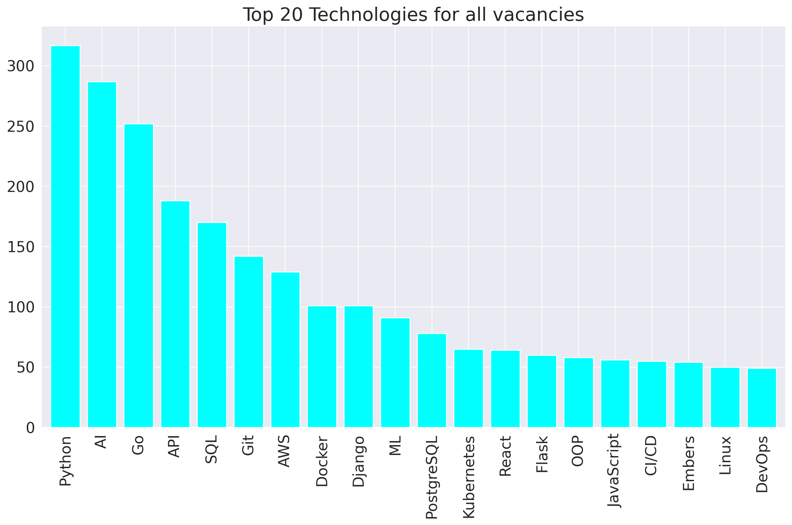

# Djinni technologies statistics

This application analyzes job vacancies data and generates visualizations and insights based on the information scraping from [djinni website](https://djinni.co/). 
It processes files containing information about job vacancies, such as the title, required technologies, salary, views, and applicants. The app performs various analyses and creates visualizations to gain insights into the data.

# Features
1. Scraping information from djinni website using Scrapy spider.
2. Data clearing and analyzing:
   - **Top Technologies Analysis**: The app identifies the top 20 technologies in all vacancies as well as in specific categories such as junior, middle, and senior positions. It generates bar charts to visualize the frequency of these technologies in the job vacancies.

   - **Company Type Distribution**: The app analyzes the distribution of company types in the job vacancies data. It creates a pie chart to represent the percentage and count of different company types.

   - **Correlation Analysis**: The app explores the correlation between job experience, salary, views, and applicants. It generates a correlation matrix and a scatter plot matrix (pairplot) to visualize the relationships between these variables.
3. Storing results (diagrams).

## Installation

1. Clone the repository:
   ```bash
   git clone https://github.com/SergiiMachulin/djinni-technologies-statistics.git
   ```
2. Create a virtual environment:
   ```
   python -m venv venv
   ```
3. Activate the virtual environment: 
   ```bash 
   source env/bin/activate(on unixOS)
   ```  
   ```bash
   env\Scripts\activate (on Windows)
   ```
4.  Install the required dependencies:
   ```bash
   pip install -r requirements.txt
   ```
5. Prepare the data:

   ```bash
   scrapy crawl vacancies -o vacancies_all.jl && scrapy crawl vacancies -o vacancies_junior.jl -a experience=no_exp && scrapy crawl vacancies -o vacancies_junior.jl -a experience=1y && scrapy crawl vacancies -o vacancies_middle.jl -a experience=3y && scrapy crawl vacancies -o senior.jl -a experience=5y
   ```

## Usage

1. Run the application:

   ```bash
   python app.py
   ```

2. The application will generate various visualizations and insights based on the job vacancies data.

3. The generated plots will be saved in the `archive_{DIRECTION}` directory, which includes subdirectories for each type of visualization.


